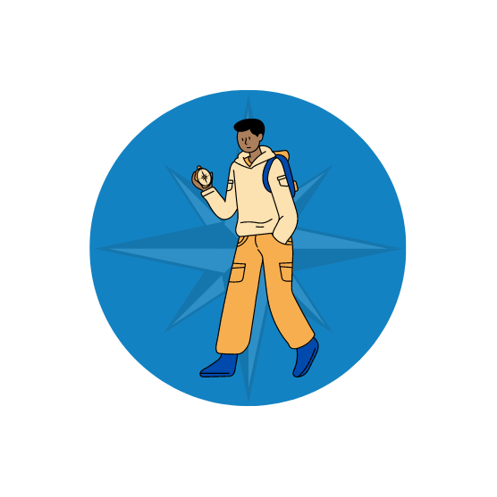

<h2>Hi, I'm Allassane! </h2>

### Hi there 👋, Hi! I'm Allassane
#### Remote Full-stack web developer ready for new challenges

**About me**
Hi! My name is Allassane, I'm a passionate full-stack web developer who enjoys challenging himself by developing new skills most productively.
:android I'm also self-taugh android developper
:degree I have a master degree in telecommunication

**Like**
:compass I love pushing myself on new challenges/projects, specially if there require [Deep Work](https://www.calnewport.com/books/deep-work/)
:video_game I play video game in my free time
:tv I watched MR.Robot

**Skills**: JS | REACT JS, Redux  | Kotlin (Android Studio)

-  I’m currently currently following Mircoverse Program.

  

  

  

  

  

   
